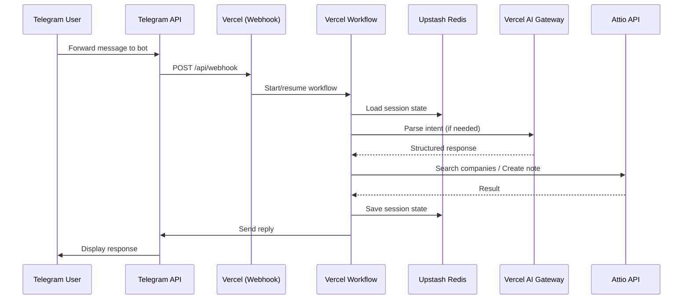

# Architecture

## Overview

Telegram to Attio CRM bot - a serverless Next.js application that forwards Telegram messages to Attio CRM records.

## System Flow

## Components

### Webhook Handler (`app/api/webhook/route.ts`)
Entry point for Telegram messages. Routes to appropriate workflow step.

### Vercel Workflows (`workflows/`)
Durable execution for multi-step conversations:
- `conversation-ai.ts` - AI-powered intent parsing
- `conversation.ts` - State machine for user flow
- `hooks.ts` - Webhook event handlers

### Services (`src/services/`)
External service integrations:
- Attio API client
- Redis session storage

### AI Layer (`src/ai/`)
LLM-powered features:
- Intent classification
- Company name extraction
- Deadline parsing

## Data Flow

1. **Message Received**: Telegram webhook → Vercel serverless function
2. **Session Loaded**: User state from Upstash Redis
3. **Intent Parsed**: AI Gateway classifies user intent
4. **Action Executed**: Attio API for CRM operations
5. **Response Sent**: Reply via Telegram Bot API

## External Dependencies

| Service | Purpose | Required Env Vars |
|---------|---------|-------------------|
| Telegram Bot API | Message handling | `BOT_TOKEN` |
| Attio API | CRM operations | `ATTIO_API_KEY` |
| Upstash Redis | Session storage | `UPSTASH_REDIS_REST_*` |
| Vercel AI Gateway | LLM inference | `AI_GATEWAY_API_KEY` |
